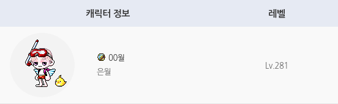

[](https://crates.io/crates/maplestory)
[](https://docs.rs/maplestory)

# maplestory
easy-to-use MapleStory API wrapper for Rust

## Regional Support

Currently, this crate is only available on [KMS](https://maplestory.nexon.com/).

Support for [MSEA](https://www.maplesea.com/) is coming soon.

Other regions like GMS(https://www.nexon.com/maplestory/) will be supported once Nexon provides official APIs for those regions.

## Example

You can use other asynchronous crates, however, in this async example, we will use [Tokio](https://tokio.rs/).

```sh
cargo add maplestory
cargo add tokio --features full
```

So your `Cargo.toml` would look like:

```toml
maplestory = { version = "1.0.0" }
tokio = { version = "1.48.0", features = ["full"] }
```

Then, on your `main.rs`,

```Rust
use maplestory::prelude::*;

#[tokio::main]
async fn main() {
    let api = MaplestoryApi::builder().api_key("YOUR_API_KEY").build().unwrap();
    let ocid = api.get_id("00월").await.unwrap().ocid;
    let character_level = api
        .get_character_basic(&ocid, None)
        .await
        .unwrap()
        .character_level;

    println!("{character_level}");
}
```


This example prints 281, my character level (which has probably increased since I wrote this README).

## Description
```Rust
struct MaplestoryApi {
    region: Region,
    api_key: String,
    origin: String,
}
```

`MaplestoryApi` consists of 3 fields:
- `region`: Represents the region such as KMS, MSEA. Default is KMS.
- `api_key`: Can be obtained from https://openapi.nexon.com/.
- `origin`: Default is https://open.api.nexon.com/. Or you can specify any proxy server. For an example, visit [nexon-open-api-proxy](https://github.com/psvm203/nexon-open-api-proxy).

For schema descriptions, please refer to [KMS docs](https://openapi.nexon.com/en/game/maplestory/) or [MSEA docs](https://openapi.nexon.com/en/game/maplestorysea/).
When the official documentation differs from the actual API response structure, schemas are based on the actual API responses.

Since API responses are in JSON format, their values are nullable.
However, making all Rust fields optional would be terrible.
So instead, through multiple attempts, only some fields are set as optional.

Due to this, errors may occur when actual response values, which are null, are received as non-optional values.
In such cases, please report them through [issues](https://github.com/psvm203/nexon-open-api-proxy/issues).

For example, the structure of the `CharacterBasic` schema is as follows:

```Rust
struct CharacterBasic {
    date: Option<String>,
    character_name: String,
    world_name: String,
    character_gender: String,
    character_class: String,
    character_class_level: String,
    character_level: u32,
    character_exp: u64,
    character_exp_rate: String,
    character_guild_name: Option<String>,
    character_image: String,
    character_date_create: String,
    access_flag: String,
    liberation_quest_clear: String,
}
```

When user does not provide the optional date parameter, the `date` field becomes null.

When character not joined to a guild, the `character_guild_name` field becomes null.

Other fields are not null in any case.

## License
This project is licensed under the [MIT license](./LICENSE).
